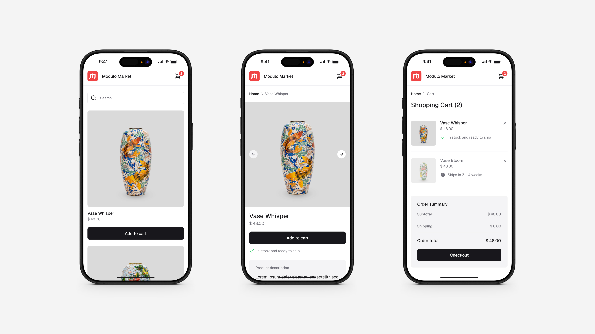

# Modulo Market

**Modulo Market** is a small online shop built with **React**, created as a personal learning project by [Stephan](https://github.com/StephMode) and [Benjamin](https://github.com/benjaminpfleghaar). Together we want to strengthen our frontend skills and experiment with new technologies and tools in a hands-on way.



The complete styleguide including colors, icons and layouts can be found in this Figma file: [Styleguide](https://www.figma.com/design/Iw2EobZE1BCoDp3stKFsAp/Modulo-Market-Design?node-id=2062-350)

## Features

- **Product Overview**: Browse all available products in one place
- **Product Detail Page**: View high-quality product images with an interactive slider
- **Stripe Integration**: Secure and seamless checkout powered by Stripe

## Technologies

This project is built with:

- **Library**: [React](https://react.dev/)
- **Styling**: [Tailwind](https://tailwindcss.com)
- **Checkout**: [Stripe](https://stripe.com/de)
- **Images**: [Unsplash](https://unsplash.com/de)
- **Icons**: [Heroicons](https://heroicons.com/)
- **Testing**: [Jest](https://jestjs.io/)
- **Font**: [Geist](https://vercel.com/font)

## Getting Started

Ensure you have **Node.js** installed on your machine.

### Installation

1. Clone the repository:
   ```bash
   git clone https://github.com/benjaminpfleghaar/modulo-market.git
   ```

2. Install dependencies:
   ```bash
   npm install
   ```

3. Run the application:
   ```bash
   npm run dev
   ```

## Project Structure

The project follows a clear structure:

```plaintext
src/                # Source code
├── assets/         # Static assets
│   ├── fonts/
│   ├── images/
├── components/     # UI components
├── lib/            # Utility functions
├── pages/          # Page components
├── styles/         # Global styles
│
├── main.tsx        # React root file
```